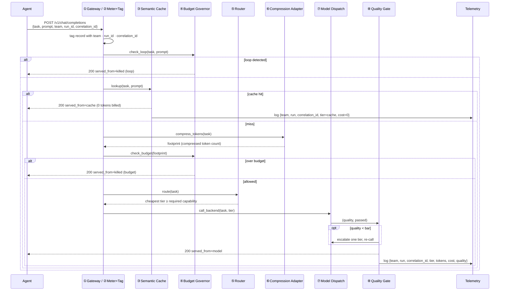

```mermaid
graph LR
  subgraph CP["TokenIQ Control Plane (hot path)"]
    direction LR
    S1["① Gateway<br/>OpenAI-compat ingress"]
    S2["② Meter + Tag<br/>team · run_id · correlation_id"]
    S3["③ Semantic Cache<br/>exact + similarity reuse"]
    S4["④ Budget Governor<br/>quota · kill switch · loop detect"]
    S5["⑤ Model Router<br/>cheapest tier clearing bar"]
    S6["⑥ Compression Adapter<br/>Headroom-style · pluggable"]
    S7["⑦ Model Dispatch<br/>via LiteLLM to provider"]
    S8["⑧ Quality Gate<br/>validate · escalate · retry"]
    S1 --> S2 --> S3 --> S4 --> S5 --> S6 --> S7 --> S8
  end

  subgraph PROD["① AI Producers"]
    A1[Coding agents<br/>Claude Code · Cursor · Codex]
    A2[Agentic workflows<br/>LangGraph · internal]
    A3[RAG / Copilots]
    A4[Enterprise apps<br/>ServiceNow · Teams]
  end

  subgraph PROV["③ Model Endpoints"]
    P1[OpenAI]
    P2[Anthropic]
    P3[AWS Bedrock]
    P4[Internal LLMs]
  end

  subgraph DATA["④ Production State & Telemetry"]
    D1[(Redis<br/>run state · counters · rate limits)]
    D2[(Vector Store<br/>pgvector / FAISS semantic index)]
    D3[(Postgres<br/>cost ledger · audit · telemetry)]
  end

  subgraph LOOP["⑤ Learning & Economics Loop"]
    L1[Router Trainer<br/>learns cheapest passing model]
    L2[Outcome Linker<br/>Git · Jira · CI · ServiceNow]
    L3[FinOps Dashboard<br/>showback · chargeback · budgets]
    L4[Executive KPIs<br/>cost/ticket · quality · risk avoided]
    L1 --> L2 --> L3 --> L4
  end

  PROD --> S1
  S7 --> PROV
  S3 -.cache index.-> D2
  S4 -.run state.-> D1
  S8 -.telemetry.-> D3
  D3 --> L1
  L1 -.policy updates.-> S5
```

# Reference architecture — TokenIQ

A single governed gateway sits in front of every LLM call. It is the one place that can
**see, cut, cap, and price** token spend across your organization's agents and engineers.

> **Control plane, not compressor.** Compression is one pluggable stage. The defensible
> layer is routing + governance + outcome pricing tuned on proprietary telemetry.


---

## 1. 8-stage pipeline

Every request passes through these stages in order. Stages 1–5 and 8 are Running PoC;
stages 6–7 are PoC / Production Target (simulated today, LiteLLM integration in progress).

```
[1] Gateway → [2] Meter+Tag → [3] Semantic Cache → [4] Budget Governor
    → [5] Model Router → [6] Compression Adapter → [7] Model Dispatch → [8] Quality Gate
```



---

## 2. Request lifecycle



> **Implementation note:** compression footprint is computed before the budget check
> (so the governor sees the real billed size), then the same footprint is passed to
> the model call. Logically this is stage 6 before stage 7; the budget check at
> stage 4 uses the already-compressed count.

---

## 3. Component responsibilities

| # | Stage | Responsibility | PoC file | Production swap |
|---|---|---|---|---|
| 1 | **Gateway** | OpenAI-compatible HTTP ingress; single chokepoint for all model calls | `gateway.py` | LiteLLM proxy / Envoy + mTLS |
| 2 | **Meter + Tag** | Attach `team`, `agent_run_id`, `correlation_id` to every telemetry record | `gateway.py` (`ChatRequest` + telemetry emit) | Structured log shipper → cost ledger |
| 3 | **Semantic Cache** | Return prior answer on exact-hash or Jaccard-similarity match | `control_plane.py` (`SemanticCache`) | pgvector / FAISS, cosine ≥ 0.95 |
| 4 | **Budget Governor** | Per-run token cap + runaway-loop kill switch | `control_plane.py` (`BudgetGovernor`) | Redis-backed counters + circuit breaker |
| 5 | **Model Router** | Pick cheapest tier whose capability ≥ task requirement | `control_plane.py` (`route`) | Learned policy (contextual bandit over telemetry) |
| 6 | **Compression Adapter** | Shrink input context before dispatch (pluggable transform) | `control_plane.py` (`compress_tokens`) | Headroom proxy/library |
| 7 | **Model Dispatch** | Forward compressed request to selected provider endpoint | `gateway.py` (`call_backend` — simulated) | LiteLLM routing layer → OpenAI / Anthropic / Bedrock / internal |
| 8 | **Quality Gate** | Validate output quality; escalate one tier and retry on failure | `control_plane.py` (`run_model` + escalation in `gateway.py`) | Regex / test suite / LLM-judge |

**Loop-layer components** (asynchronous, not on the hot path):

| Component | Responsibility | Status |
|---|---|---|
| Router Trainer | Learn cheapest model-per-task-fingerprint from quality outcomes | Roadmap |
| Outcome Linker | Join `correlation_id` → SDLC events (Git, Jira, CI) for cost-per-outcome | Roadmap |
| FinOps Dashboard | Showback / chargeback by team and outcome | Roadmap |
| Executive KPIs | Cost per ticket, quality score, risk avoided | Roadmap |

---

## 4. Data & state

| Store | Holds | Status |
|---|---|---|
| Redis | Per-run token counters, governor loop state, rate limits | Production Target |
| Vector store (pgvector / FAISS) | Cache embeddings, router task fingerprints | Production Target |
| Postgres | Telemetry, cost ledger, chargeback audit trail | Production Target |

PoC uses in-process dicts (`CACHE`, `GOVERNORS`, `TELEMETRY` in `gateway.py`). Swap to
the stores above without changing any control-plane logic — the gateway is the only writer.

---

## 5. Deployment topology

- **Centrally operated, not per-developer.** Agents point their OpenAI-compatible `base_url`
  at the TokenIQ gateway. This fits a regulated, audited enterprise runtime.
- **Sidecar option** for latency-sensitive teams: cache + governor as a local sidecar,
  telemetry shipped centrally.
- **Stateless gateway, externalized state** (Redis + Postgres) — scales horizontally behind
  a load balancer.

---

## 6. Cross-cutting concerns

| Concern | How it's handled |
|---|---|
| Audit | Every call logged with `team` / `agent_run_id` / `correlation_id` in the cost ledger |
| RBAC & quotas | Per-team budgets enforced at the governor (stage 4) |
| Data residency | Compression + cache run inside the trust boundary; no payloads leave |
| Safety | Kill switch caps runaway agent spend (blast radius) |
| Cost attribution | Chargeback/showback by team and by SDLC outcome via `correlation_id` |

---

## 7. The four core value levers

| Lever | Cuts | Mechanism | Stage |
|---|---|---|---|
| Semantic cache | Tokens (skips calls entirely) | Reuse prior answers on exact or semantic match | ③ |
| Router | Cost (cheaper tier) | Cheapest model that clears the quality bar | ⑤ |
| Compression | Tokens (smaller payload) | Content-aware context shrink before dispatch | ⑥ |
| Governor | **Risk** (blast radius) | Per-run cap + runaway loop kill switch | ④ |

Three levers cut the bill; one caps the risk. Verified: cost per resolved ticket
**$4.38 → $0.31 (−93%)**, quality held at 0.89.
