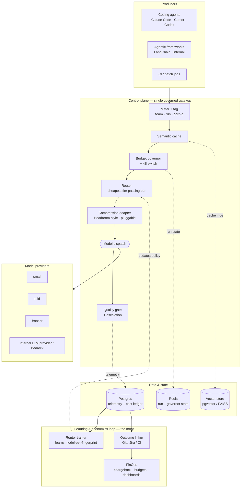
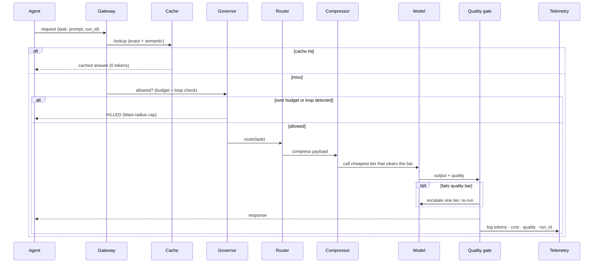

# Reference architecture — TokenIQ

A single governed gateway sits in front of every LLM call. It is the one place that can
**see, cut, cap, and price** token spend across your organization's agents and engineers.

> **Control plane, not compressor.** Compression is one pluggable stage. The defensible
> layer is routing + governance + outcome pricing tuned on proprietary telemetry.

---

## 1. Layered view

The hot path is `meter → cache → govern → route → compress → model → quality gate`.
Everything to the right of the gateway (stores, trainer, linker, FinOps) is asynchronous.

---

## 2. Request lifecycle

---

## 3. Component responsibilities

| Component | Responsibility | Demo file | Production swap |
|---|---|---|---|
| Gateway | OpenAI-compatible ingress; meter + tag every call (`team`, `agent_run_id`, `correlation_id`) | `gateway.py` | LiteLLM / Envoy + auth |
| Semantic cache | Return prior answer on exact or semantic match | `control_plane.py` (`SemanticCache`) | pgvector / FAISS, cosine ≥ 0.95 |
| Budget governor | Per-run token cap + runaway-loop kill switch | `control_plane.py` (`BudgetGovernor`) | Redis-backed counters + circuit breaker |
| Router | Pick cheapest tier whose capability clears the task bar | `control_plane.py` (`route`) | Learned policy (contextual bandit) |
| Compression adapter | Shrink input context before the model | `control_plane.py` (`compress_tokens`) | **Headroom** proxy/library |
| Quality gate | Validate output; escalate a tier on failure | `control_plane.py` (`run_model` + escalation) | Tests / regex / LLM-judge |
| Telemetry | Log tokens, cost, quality, IDs | `gateway.py` (`/metrics`) | Postgres + stream |
| Router trainer | Learn cheapest model-per-fingerprint from quality outcomes | (loop) | Offline job over telemetry — **the moat** |
| Outcome linker | Join `correlation_id` → SDLC events for cost-per-outcome | (loop) | Git / Jira / CI webhooks |

---

## 4. Data & state

| Store | Holds | Why |
|---|---|---|
| Redis | Per-run token counters, governor loop state | Low-latency, hot-path reads/writes |
| Vector store (pgvector / FAISS) | Cache embeddings, router task fingerprints | Semantic lookup + routing memory |
| Postgres | Telemetry, cost ledger, chargeback | System of record, audit, FinOps |

---

## 5. Deployment topology (enterprise fit)

- **Centrally operated, not per-developer.** The gateway runs as a governed service; agents
  point their OpenAI-compatible base URL at it. This fits a regulated, audited, sandboxed
  enterprise runtime better than a local per-developer process.
- **Sidecar option** for latency-sensitive teams: cache + governor as a local sidecar, telemetry
  shipped centrally.
- **Stateless gateway, externalized state** (Redis + Postgres) so it scales horizontally behind a load balancer.

---

## 6. Cross-cutting concerns

| Concern | How it's handled |
|---|---|
| Audit | Every call logged with team/run/correlation IDs in the cost ledger |
| RBAC & quotas | Per-team budgets enforced at the governor |
| Data residency | Compression + cache run inside the trust boundary; no payloads leave |
| Safety | Kill switch caps runaway agent spend (blast radius) |
| Cost attribution | Chargeback/showback by team and by outcome |

---

## 7. The four levers

| Lever | Cuts | Mechanism |
|---|---|---|
| Semantic cache | Tokens (skips calls) | Reuse prior answers |
| Router | Cost (cheaper tier) | Cheapest model that clears the quality bar |
| Compression | Tokens (smaller payload) | Content-aware context shrink (pluggable) |
| Governor | **Risk** (blast radius) | Per-run cap + runaway kill switch |

Three levers cut the bill; one caps the risk. Verified: cost per resolved ticket
**$4.38 → $0.31 (−93%)**, quality held at 0.89.
