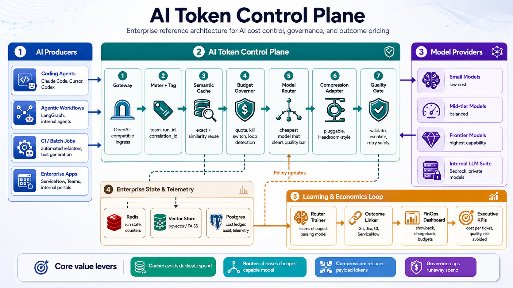

# AI Token Control Plane

## Governance, Optimization, and FinOps for Agentic AI

Enterprise reference architecture for governing, optimizing, and measuring AI consumption across copilots, coding agents, RAG pipelines, AI workflows, and enterprise applications.

Make every LLM call in your organization **metered, routed, cached, compressed, governed, and priced by outcome** so AI adoption scales without costs scaling with it.

---

## Executive Summary

As AI adoption accelerates across the enterprise, token consumption becomes the new compute cost.

Organizations are rapidly deploying coding assistants, agentic workflows, retrieval-augmented generation (RAG), copilots, and AI-powered applications. While these capabilities drive productivity, they also introduce a new challenge: uncontrolled token consumption, inconsistent governance, and rapidly increasing AI operating costs.

The **AI Token Control Plane** introduces a centralized governance and optimization layer in front of every AI interaction.

Similar to how Cloud FinOps transformed cloud spending through visibility, governance, and accountability, the AI Token Control Plane provides a framework for managing AI consumption at enterprise scale.

> Enable AI adoption at scale while maintaining governance, controlling costs, reducing waste, and preserving output quality.

---

## Business Outcomes

* Reduce AI operating costs through intelligent routing and caching
* Establish governance, budgeting, and policy enforcement for AI usage
* Prevent runaway agentic workflows and uncontrolled spend
* Enable chargeback/showback across teams and business units
* Maintain output quality while optimizing token consumption
* Create a foundation for enterprise AI FinOps

---

## Why This Matters

Without a control plane, enterprises face:

* Unbounded token growth
* Excessive use of frontier models
* Duplicate AI requests across teams
* Limited cost attribution
* Minimal governance controls
* Runaway agentic workflows
* Growing AI spend disconnected from business value

The AI Token Control Plane addresses these challenges through a layered architecture that combines governance, optimization, observability, and FinOps into a single enterprise platform.

---

## What Makes This Different

This is a **control plane, not a compressor.**

Payload compression (e.g. <a href="https://github.com/chopratejas/headroom" target="_blank">Headroom</a>) is one pluggable optimization stage.

The defensible layer, and ultimately the enterprise moat, is:

* Intelligent model routing
* Budget governance
* Policy enforcement
* Semantic caching
* Quality assurance
* Outcome-based pricing
* Telemetry-driven optimization

These capabilities become more valuable as AI adoption grows.

> One gateway sits in front of every model call. That single control point lets you see token spend, optimize it, govern it, cap runaway usage, and continuously improve efficiency through enterprise telemetry.

Pipeline:

`meter → cache → governor → router → compress → model → quality gate`



---

## What's Here

| File                      | What it is                                                                               | Use it for                                                             |
| ------------------------- | ---------------------------------------------------------------------------------------- | ---------------------------------------------------------------------- |
| `control_plane_demo.html` | Self-contained visual simulator (vanilla JS, no deps)                                    | **The stage demo.** Double-click to open in any browser. Runs offline. |
| `control_plane.py`        | Core logic: router, semantic cache, budget governor, quality gate, metrics (stdlib only) | The engineering proof of concept                                       |
| `gateway.py`              | FastAPI OpenAI-compatible proxy + `/metrics` + `/reset` (sim mode by default)            | Demonstrates production-ready integration patterns                     |
| `demo.py`                 | CLI: naive vs control-plane, plus runaway kill-switch scenario                           | `python3 demo.py` or `.venv/bin/python demo.py`                        |
| `langgraph_app.py`        | Control plane as a LangGraph `StateGraph` (reuses `control_plane.py` core logic)         | `python langgraph_app.py` — prints graph + Mermaid diagram             |
| `ARCHITECTURE.md`         | Full reference architecture with Mermaid layered view and request lifecycle diagrams     | Deep-dive on components, data stores, deployment topology              |

---

## Run the Visual Demo (No Install)

Open `control_plane_demo.html` in a browser.

Use the **master toggle** to enable or disable all features at once, or tune individual controls (Router / Semantic Cache / Budget Governor / Payload Compression).

Press **Run Agent** to watch requests flow through the control plane.

Press **Run Buggy Agent** to see the governor kill switch terminate runaway behavior mid-stream.

Use the **fleet slider** to project gross annual cost and estimated savings at enterprise scale.

All features off = naive baseline: frontier-only, no cache, no governor.

---

## Run the Python Demo

```bash
python3 demo.py
```

If you prefer a local virtualenv:

```bash
python3 -m venv .venv
source .venv/bin/activate
python demo.py
```

---

## Run the LangGraph App (Optional)

Requires `langgraph` in addition to the base dependencies.

```bash
pip install langgraph
python langgraph_app.py
```

Prints the result for a sample `codegen` request and outputs the graph as a Mermaid diagram.
The LangGraph version reuses the exact same core logic from `control_plane.py` — behaviour matches the gateway and the CLI demo.

---

## Run the Gateway (Optional)

```bash
python3 -m venv .venv
source .venv/bin/activate

python -m pip install -r requirements.txt

uvicorn gateway:app --reload

curl -s localhost:8000/v1/chat/completions \
  -H 'content-type: application/json' \
  -d '{"task":"codegen","agent_run_id":"run-1","prompt":"fix null currency NPE"}'

curl -s localhost:8000/metrics

# Reset telemetry and per-run governor state:
curl -s -X POST localhost:8000/reset
```

---

## Run with Docker

```bash
docker compose up --build
```

Services:

* Gateway API → http://localhost:8000
* Visual Demo → http://localhost:8080

State is in-memory today.

To match the reference architecture, uncomment the `redis` and `postgres` services in `docker-compose.yml` and point the cache, governor, and telemetry services at them.

---

## Verified Demo Numbers (One Agent Resolving One Ticket)

| Metric                   | Naive (Frontier Only) | Control Plane | Improvement |
| ------------------------ | --------------------: | ------------: | ----------: |
| Tokens                   |               273,000 |       114,430 |        -58% |
| Cost                     |                 $4.09 |         $0.28 |        -93% |
| Quality (Q)              |                  0.93 |          0.89 |  Maintained |
| Cost per Resolved Ticket |                 $4.38 |         $0.31 |        -93% |

---

## Optimization Levers

| Stage                 |  Cost | Cumulative Reduction |
| --------------------- | ----: | -------------------: |
| Frontier Model Only   | $4.09 |                    — |
| + Semantic Cache      | $2.76 |                 -33% |
| + Model Routing       | $0.42 |                 -90% |
| + Payload Compression | $0.28 |                 -93% |

Each optimization layer compounds on the previous one.

---

## Governance Example

A buggy agent repeatedly invoking the same request is automatically terminated after three retries.

This demonstrates the **Budget Governor**:

* Limits blast radius
* Prevents runaway costs
* Protects shared AI infrastructure
* Enforces policy automatically

Governance is as important as optimization.

---

## The Pitch in One Line

> Cloud adoption created Cloud FinOps. Agentic AI will require AI FinOps. The AI Token Control Plane is the governance, optimization, and economics layer that makes enterprise-scale AI sustainable.

---

## Strategic Benefits

### Governance

* Budget controls
* Policy enforcement
* Quotas
* Kill switches
* Auditability

### Optimization

* Semantic caching
* Intelligent model routing
* Context reduction
* Compression adapters
* Duplicate request elimination

### FinOps

* Token metering
* Cost attribution
* Chargeback / showback
* Budget reporting
* Executive dashboards

### Quality

* Response validation
* Quality gates
* Escalation to stronger models
* Continuous learning

---

## Going to Production

* Swap simulated `run_model` / `call_backend` for real provider calls (LiteLLM, Bedrock, OpenAI, Anthropic, internal LLM provider).
* Swap the Jaccard cache for real embeddings + ANN (pgvector, FAISS, Milvus), cosine ≥ 0.95.
* Swap the modeled `compress_tokens` for a real compression adapter such as <a href="https://github.com/chopratejas/headroom" target="_blank">Headroom</a>.
* Move cache, governor, and telemetry state to Redis and PostgreSQL.
* Replace the cold-start router rules with a learned policy updated by quality-gate outcomes.
* Build executive dashboards for governance and FinOps reporting.

---

## Why Not Just Use a Compression OSS Tool?

Compression shrinks payloads.

It does **not**:

* Select the optimal model
* Govern budgets
* Enforce policy
* Stop runaway agents
* Attribute costs
* Measure business outcomes

Tools like <a href="https://github.com/chopratejas/headroom" target="_blank">Headroom</a> are excellent on the compression axis and plug naturally into this architecture.

The control plane owns routing, governance, quality assurance, and AI economics.

Those are the capabilities that enable enterprise-scale AI adoption.

---

## Long-Term Vision

API gateways became standard for governing services.

Cloud FinOps became standard for governing cloud consumption.

As AI adoption scales, enterprises will require a similar layer for governing AI consumption.

The AI Token Control Plane is a reference architecture for that future.

---

*Illustrative pricing assumptions: Small Model $0.30, Mid-Tier Model $3.00, Frontier Model $15.00 per 1M tokens.*
